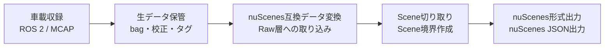
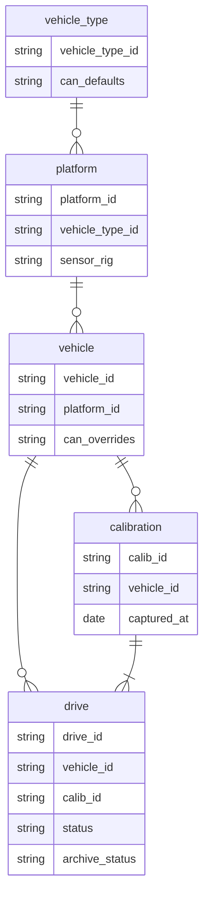
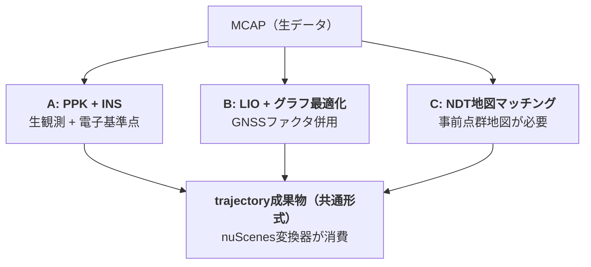

# shasou-recorder
センサまたはCARLA等のシミュレーションを接続したJetson等で動作させ、End-to-end自動運転向けのデータ収集を実施するツールキット。shasouエコシステムの一部

## Project Overview
### shasou eco system概要
shasouエコシステムは、以下のフローでEnd-to-end自動運転向けのデータ収集・キュレーションを実施



shasouエコシステムは、以下3リポジトリから構成される
- **shasou-recorder** (本リポジトリ): Jetson等で動作させ、車載収録を実施するツールキット (ROS 2 / MCAP)
- **shasou-studio**: recorderで取得したデータをインポートして保管し、nuScenes互換データ変換、Scene切り取り、nuScenes形式出力等を実施するためのWebアプリ。データキュレーションのための分析機能も含む
- **shasou-core**: 上記 2 つが共有するmanifestスキーマ・MCAPトピック規約・trajectory成果物形式をPydantic + JSON Schemaで定義

#### データの階層構造
記録されるデータは以下の階層構造を持つ



- vehicle_type: 車種を表す。ホイールベース・外形寸法等の公称物理パラメータと、CAN仕様のデフォルト（can_defaults）を持つ。同一vehicle_typeでも個体差でCAN仕様が異なりうる分はvehicleのcan_overridesが上書きする。shasou-studioで定義を作成・管理し、recorderは同期時にvehicleから紐付けて取得（studio非依存のローカル定義でも動作可）
- platform: センサ構成（sensor_rig）・車種（vehicle_type）が一致するデータをグルーピングしたもの。同一platformに複数の車両個体（vehicle）が属しうる（フリート運用）。shasou-studioで定義を作成・管理し。recorderは同期時にvehicleから紐付けて取得（studio非依存のローカル定義でも動作可）
- vehicle: 車両個体を表す。所属platform（platform_id）と、車種デフォルトをフィールド単位で上書きするCAN仕様（can_overrides）を持つ。実効CAN仕様は車種のcan_defaultsをcan_overridesが覆って求める。運用管理情報はshasou-studioの責務でcoreは持たない。shasou-studioで登録・管理し、recorder同期時のキーとして作用する（studio非依存のローカル定義でも動作可）
- calibration: キャリブレーション1回ごとに作成される（複数センサを含む）。1回のcalibrationはnuScenes形式変換時に複数センサ分のcalibrated_sensorレコードに展開される。shasou-recorderがキャリブレーションごとに自動作成する
- drive: 1走行ごとに取得され、IDとしてdrive_idが割り当てられる。1つのdriveがnuScenes形式変換後のlogと1対1で対応。shasou-recorderが走行ごとに自動作成する

#### データ収集のワークフロー
データ収集は以下の流れで実施
1. 設定のrecorderへの共有 ：shasou-studioで作成したplatform定義等の設定を、shasou-recorder側にダウンロード
2. 車上Jetson＋SSD（NVMe）で収録 ：shasou-recorderが実施
3. NAS：shasou-studioの直近数ヶ月程度のデータのストレージとして使用。書き込みはshasou-recorderが実施
4. S3：shasou-studioのアーカイブデータのストレージとして使用

各レコード（データの階層構造におけるdrive）はワークフローのどこにあるかをメタデータの`status`および`archive_status`で保持する。
- `status`は以下の状態から選ぶ
    - `recorded`：収録完了（車上SSDに存在）
    - `transferred`：NASへコピー完了（まだ検証前）
    - `verified`：チェックサム照合が通った（NAS上で健全性確認済み）
    - `imported`：shasou-studioがRaw層に取り込んだ
- `archive_status`は以下の状態から選ぶ
    - `none`：NASのみ
    - `archived`：S3標準
    - `glacier`：Glacier Deep Archive退避

## 収集データの形式
### 収集ワークフローにおけるshasou-recorderの責務
- 車上: データ収録してSSDへ保存
- オフィス: NASへ転送 + チェックサム検証

### 収集データのフォルダ構成
shasou-recorderは以下のフォルダ構成でデータを収集

```
data/
├── platform_lincoln_6cam-lidar/       # platformごとにフォルダを分ける
|   ├── drives/
|   │   └── 2026-07-16_1030_vehicle01_osaka-umeda/   # drive_id
|   │       ├── manifest.yaml          # ドライブの自己記述メタデータ
|   │       ├── bags/
|   │       │   ├── segment_0000.mcap  # 分割収録（後述）
|   │       │   ├── segment_0001.mcap
|   │       │   └── checksums.sha256
|   │       ├── tags/
|   │       │   └── events.jsonl       # 収録中のイベントタグ（追記のみ）
|   │       ├── health/
|   │       │   └── topic_stats.json   # Hz・ドロップ率・ディスクログ
|   │       └── notes.md               # 同乗者の自由記述（任意）
|   └── vehicles/
|       ├── vehicle01/
|       |   └── calibrations/
|       |       ├── calib_v003_2026-07-01/ # キャリブレーション実施ごとに1フォルダ
|       |       │   ├── intrinsics/        # カメラ内部パラメータ
|       |       │   ├── extrinsics/        # センサ間外部パラメータ
|       |       │   └── report.pdf         # キャリブ品質レポート
|       |       └── ...
|       ├── vehicle02/
|       :   └── calibrations/
|               ├── calib_v003_2026-07-01/
|               └── ...
├── platform_lincoln_7cam-lidar/
:
├── vehicle_types/
|   └── lincoln_mkz.yaml
└── catalog.sqlite                 # 全ドライブの索引
```

### 各収集データの内容
#### manifest.yamlの中身
nuScenesのlogテーブル等に必要な情報を保持（将来的にはCosmos Reason等による自動タグ付けも想定）する。

```yaml
drive_id: 2026-07-16_1030_vehicle01_osaka-umeda
uuid: 7f3a...
source: real                   # real / carla / alpasim等
schema_version: v0.1.0         # shasou-coreの互換性判定に使用
platform: platform_lincoln_6cam-lidar
vehicle: vehicle01
ego_pose_backend: ppk-ins      # 自己位置推定  
calib_id: calib_v003_2026-07-01
date_captured: "2026-07-16"
location: osaka-umeda          # → nuScenes変換後のlog.locationとなる
driver: tanaka
weather: rain                  # → nuScenes変換後のscene.descriptionの素材となる
recorder_version: v1.2.0       # 収録ソフトのバージョン
sensor_config:                 # トピック名 ⇔ nuScenesチャネル名の対応
  LIDAR_TOP: /sensing/lidar_top/points
  RADAR_FRONT: /sensing/radar_front/points
  CAM_FRONT: /sensing/cam_front/image_raw/compressed
  ...
status: verified               # recorded → transferred → verified (→ imported)
```

#### catalog.sqlite
検索高速化のため、manifestと同内容をcatalog.sqlite（データベース）に記録しておく。

#### event.jsonl
運転中にユーザーが各種端末（物理/ステアリングボタンやタブレット）から入力した情報をROS2 Topicとして受け取り、JSONL形式で以下のように保存しておく（フィールド等はshasou-coreで定義）

```jsonl
{"timestamp": 1752641234.512, "type": "interesting", "label": "cut-in", "source": "driver_button"}
{"timestamp": 1752641301.220, "type": "marker", "label": "construction zone", "source": "tablet"}
```

#### ego_pose_backendの選択肢
メタデータの`ego_pose_backend`に記録する自己位置推定の方法は、以下から選択する



### 収集に使用するTopic


#### 実車・シミュレーション共通

以下の中から、

|Topic名|Topic型|frame_id|座標系|内容|
|---|---|---|---|---|
|`shasou/<sensor_id>/image_raw/compressed`|sensor_msgs/CompressedImage|<id>|-|RGBカメラの画像|
|`shasou/<sensor_id>/camera_info`|sensor_msgs/CameraInfo|<id>|-|RGBカメラの内部パラメータ|
|`shasou/<sensor_id>/points`|sensor_msgs/PointCloud2|<id>|センサ位置を原点とした相対座標|LiDAR点群|
|`shasou/<sensor_id>/points`|sensor_msgs/PointCloud2|<id>|センサ位置を原点とした相対座標|RADAR点群|
|`shasou/<sensor_id>/fix`|sensor_msgs/NavSatFix|gnss|緯度経度|GNSSが測定した緯度経度|
|`shasou/<sensor_id>/data`|sensor_msgs/Imu|imu|IMUセンサ座標系（x:前方、y:左方、z:上方）|IMUの出力|
|`shasou/vehicle/drive_state`|ackermann_msgs/AckermannDriveStamped|base_link|-|speed（m/s、後退負）+ steering_angle（rad）|
|`shasou/vehicle/pedals`|sensor_msgs/JointState|""|-|ペダルストローク（正規化[0,1]）|
|`shasou/vehicle/reverse`|std_msgs/Bool|-|-|ギア後退|
|`shasou/vehicle/handbrake`|std_msgs/Bool|-|-|パーキングブレーキ|
|`/shasou/events`|shasou_msgs/EventTag（独自メッセージ）|-|-|ユーザーが各種デバイスで入力したイベント情報|

`sensor_id`を含むTopicのTopic名は、実際にはmanifest.yamlの`sensor_config`で設定する。

#### 実車のみ

#### シミュレーションのみ

|Topic名|Topic型|frame_id|座標系|内容|
|---|---|---|---|---|
|`shasou/gt/ego_odom`|nav_msgs/Odometry|map（base_linkがchild）|グローバル座標（ROS右手系）|自車位置（`/tf`をnav_msgs/msg/Odometry型で表したもの）|
|`shasou/gt/objects`|vision_msgs/Detection3DArray|map|グローバル座標（ROS右手系）|全アクターの3D BBox座標（アノテーション情報）|
|`shasou/agent/plan`|nav_msgs/Path|map|グローバル座標（ROS右手系）|PDM-Liteの計画軌跡|
|`/clock`|rosgraph_msgs/Clock|-|-|シミュレーション時刻|
|`/tf_static`|tf2_msgs/TFMessage|base_link（各センサがchild）|自車位置を原点とした相対座標|自車基準位置（base_link=後車軸の真下の地面）から各センサ位置までの相対座標|
|`/tf`|tf2_msgs/TFMessage|map（base_linkがchild）|グローバル座標（ROS右手系）|自車基準位置（base_link）のグローバル座標|


