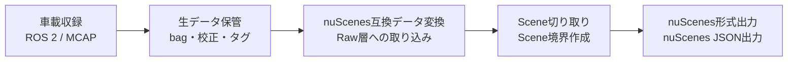

# shasou-recorder
センサまたはCARLA等のシミュレーションを接続したJetson等で動作させ、End-to-end自動運転向けのデータ収集を実施するツールキット。shasouエコシステムの一部

## 0. shasou-recorder とは
### shasou eco system概要
shasouエコシステムは、以下のフローでEnd-to-end自動運転向けのデータ収集・キュレーションを実施



shasouエコシステムは、以下4リポジトリから構成される
- **shasou-recorder**（本リポジトリ）: Jetson等で動作させ、車載収録を実施するツールキット (ROS 2 / MCAP)。想定している概要は`docs/recorder_summary.md`も参照
- **shasou-studio**: recorderで取得したデータをインポートして保管し、nuScenes互換データ変換、Scene切り取り、nuScenes形式出力等を実施するためのWebアプリ。データキュレーションのための分析機能も含む
- **shasou-core**: 上記 2 つが共有するmanifestスキーマ・MCAPトピック規約・trajectory成果物形式をPydantic + JSON Schemaで定義
- **shasou-msgs**: shasou-recorderと外部ROSノードのやり取りに使用するオリジナルROSメッセージ

recorder の責務は「収録と保管」まで。 nuScenes 変換は studio の責務であり、 recorder は nuScenes の概念 (sample / instance / calibrated_sensor) を扱わない。

#### データの階層構造
記録されるデータは以下の階層構造を持つ


- vehicle_type: 車種を表す。ホイールベース・外形寸法等の公称物理パラメータと、CAN仕様のデフォルト（can_defaults）を持つ。同一vehicle_typeでも個体差でCAN仕様が異なりうる分はvehicleのcan_overridesが上書きする。shasou-studioで定義を作成・管理し、recorderは同期時にvehicleから紐付けて取得（studio非依存のローカル定義でも動作可）
- platform: センサ構成（sensor_rig）・車種（vehicle_type）が一致するデータをグルーピングしたもの。同一platformに複数の車両個体（vehicle）が属しうる（フリート運用）。shasou-studioで定義を作成・管理し。recorderは同期時にvehicleから紐付けて取得（studio非依存のローカル定義でも動作可）。学習データセットの構成 (複数 platform を混ぜるか) は studio の責務で、 platform は収録リグの同一性という客観的事実だけを表す
- vehicle: 車両個体を表す。所属platform（platform_id）と、車種デフォルト仕様を個体ごとに上書きするCAN仕様（can_overrides）を持つ。実効CAN仕様は車種のcan_defaultsをcan_overridesが覆って求める。運用管理情報はshasou-studioの責務でcoreは持たない。shasou-studioで登録・管理し、recorder同期時のキーとして作用する（studio非依存のローカル定義でも動作可）
- calibration: キャリブレーション1回ごとに作成される（複数センサを含む）。**キャリブ値は個体固有**なので vehicle 配下に置く。他車両へ流用してはならない。**計算・管理は studio の責務**で、recorder は定義として同期して読むだけ。ただしキャリブ用データの収録 (チェッカーボード撮影等) は通常の収録なので`record --now` を使い、`tags` に用途を残せばよい (専用機能は持たない)
- drive: 1走行ごとに取得され、IDとしてdrive_idが割り当てられる。1つのdriveがnuScenes形式変換後のlogと1対1で対応。shasou-recorderが走行ごとに自動作成する

#### データ収集のワークフロー
データ収集は以下の流れで実施
1. 設定のrecorderへの共有 ：shasou-studioで作成したplatform定義等の設定を、shasou-recorder側にダウンロード
2. 車上Jetson＋SSD（NVMe）で収録 ：shasou-recorderが実施
3. NAS：shasou-studioの直近数ヶ月程度のデータのストレージとして使用。書き込みはshasou-recorderが実施
4. S3：shasou-studioのアーカイブデータのストレージとして使用

各レコード（データの階層構造におけるdrive）はワークフローのどこにあるかをメタデータの`status`および`archive_status`で保持する。
- `status`は以下の状態から選ぶ
    - `recorded`：収録完了（車上SSDに存在）
    - `transferred`：NASへコピー完了（まだ検証前）
    - `verified`：チェックサム照合が通った（NAS上で健全性確認済み）
    - `imported`：shasou-studioがRaw層に取り込んだ
- `archive_status`は以下の状態から選ぶ
    - `none`：NASのみ
    - `archived`：S3標準
    - `glacier`：Glacier Deep Archive退避

---

## 1. 絶対に守る規律
### 1.1 core/ と ros/ の分離 (最重要)

```
src/shasou_recorder/
  core/   純 Python。ROS に依存しない
  ros/    rclpy / rosbag2_py 依存。core/ を呼ぶ一方向依存
  cli.py  CLI エントリポイント
```

- **core/ から rclpy / rosbag2_py / shasou_msgs を import してはならない。**
  将来 ROS 以外のミドルウェアからの収録や、MCAP を直接読む変換器へ core/ を
  そのまま流用するため
- **ros/ → core/ の一方向依存のみ。** core/ が ros/ を import するのは禁止
- この規律は CI で機械検証する (shasou-core の `check_dependencies.py` と同方式:
  ROS 非導入環境で core/ の全モジュールが import できることを確認)

依存してよいもの:

| | core/ | ros/ | cli.py |
|---|---|---|---|
| 標準ライブラリ・pydantic | ○ | ○ | ○ |
| pyyaml | ○ | ○ | ○ |
| shasou-core | ○ | ○ | ○ |
| rclpy / rosbag2_py | **×** | ○ | △ (薄いラッパのみ) |
| shasou_msgs | **×** | ○ | × |

pyyaml は **YAML の読み書きのために core/ で許可する外部依存**。設定ファイル・
`definitions/` の定義・`manifest.yaml` がいずれも YAML であり、その読み書きの
当事者が core/ だから (現在は `core/config.py`。`definitions.py` / `manifest.py`
も同じ)。読み込みは **`yaml.safe_load` に限る** — 設定と定義は NAS 経由や他人の
手で置かれうるので、任意オブジェクトを構築する loader を使ってはならない。

**この表に無い外部依存を core/ に足さないこと。** 必要になったら recorder 側で
回避せず、まずこの表を更新して理由を書く。表が実態とズレたまま放置されると、
次に別の理由で依存が足されるときの歯止めが効かなくなる。

pip の依存として宣言できるのは **pydantic / pyyaml / shasou-core だけ**
(`pyproject.toml` の `dependencies`)。rclpy / rosbag2_py は apt で入る ROS 2 の
パッケージなので pip では入らず、ros extra も作らない。**ros/ を動かすには ROS 2
Humble を source した環境が要る** (§12)。裏を返せば core/ は ROS 2 無しで
インストールもテストもでき、それ自体がこの規律の証明になっている。

### 1.2 契約の正は shasou-core

トピック名・型・QoS・フィールド規約・manifest スキーマは **すべて shasou-core が正**。
recorder はそれを読んで従うだけで、独自に規約を定義しない。core を変更したく
なったら、recorder 側で回避せず core に変更を入れること。

例外は**実行時設定**（保存先パス、ROS_DOMAIN_ID、bag 分割サイズ等）。これは
recorder 固有なので recorder が独自に持つ (§5.3)。

---

## 2. エコシステム共通の設計思想

shasou-core の CLAUDE.md と共通。実装判断で迷ったらここに立ち返る。

- **正はソースに近い側**: bag が一次データ。`events.jsonl` と `topic_stats.json` は
  bag からの派生物で、いつでも再生成できる。両者が食い違ったら bag が正
- **時刻は ns 整数**: エポックからのナノ秒。float 秒は使わない (core の EventTag は
  `strict=True` で float を拒否する)。CARLA では `/clock` のシミュレーション時刻
- **右手系のみ**: 左手系 (CARLA/Unreal) は CARLA ブリッジの境界で変換済み。
  recorder は右手系しか見ない
- **判定を core に焼き込まない**: 統計は計測値の器に徹し、「健全か否か」の閾値
  判断は recorder / studio 側が持つ

---

## 3. モジュール構成

現状: **core/ は `checksum.py` を除いて実装済み。ros/ と `cli.py` は未着手。**
CI が回しているのは core/ のテストと依存規律の検証だけ (ROS 2 環境が要らないため)。

### core/ (ROS 非依存)

| ファイル | 役割 | 状態 |
|---|---|---|
| `session.py` | 収録セッションの状態機械。finalizing の順序と失敗方針 | 実装済み |
| `stats.py` | トピック統計のオンライン累積、ディスク監視 | 実装済み |
| `layout.py` | フォルダ構成の管理、drive_id 採番、パス解決 | 実装済み |
| `config.py` | 設定ファイルのスキーマ | 実装済み |
| `definitions.py` | vehicle_type/platform/vehicle/calibration 定義の取得。`DefinitionProvider` Protocol + `LocalFileProvider` | 実装済み |
| `manifest.py` | manifest.yaml の生成。`sensor_config` の解決 (導出 + 設定の上書き) | 実装済み |
| `events.py` | events.jsonl の生成。収録中の EventTag 蓄積 | 実装済み |
| `notes.py` | notes.md の書き出し (収録開始時。finalizing の手順ではない) | 実装済み |
| `yamlio.py` | YAML の読み書き (`safe_load` 固定、マッピング検証)。config / definitions / manifest が共有 | 実装済み |
| `atomicio.py` | 成果物の原子的書き出し (一時ファイル → fsync → rename)。manifest / events / notes が共有 | 実装済み |
| `checksum.py` | チェックサム計算・検証 | 未実装 |
| `catalog.py` | catalog.sqlite の読み書き。manifest からの再構築 | 実装済み |

### ros/ (rclpy 依存)

| ファイル | 役割 | 状態 |
|---|---|---|
| `node.py` | 収録ノード。購読・サービスサーバー・シグナル処理 | 未実装 |
| `writer.py` | rosbag2 (MCAP) への書き込み。`BagWriter` Protocol を満たす | 未実装 |
| `qos.py` | core の `QosProfile` → rclpy `QoSProfile` 変換 | 未実装 |
| `converters.py` | ROS メッセージ → core の型 (EventTag 等) | 未実装 |

---

## 4. 収録セッション (core/session.py)

### 4.1 状態遷移

```
IDLE → PREFLIGHT → RECORDING → FINALIZING → DONE
              ↘ abort() ────────────────────↗
```

- 1 セッション = 1 drive (= nuScenes の 1 log)。**使い捨て**で、次のドライブは
  新しいインスタンスを作る
- `abort()` は収録開始前の打ち切り (preflight 失敗、収録前の停止要求)。bag が
  まだ開いていないので finalizing は行わない

### 4.2 停止要求の集約

停止は複数経路から来る。すべて `request_stop()` に集約する:

| 経路 | StopReason |
|---|---|
| Ctrl+C (SIGINT) | `SIGNAL` |
| StopRecording サービス | `SERVICE` |
| ディスク残量の閾値割れ | `DISK_FULL` |
| トピック途絶 (将来) | `TOPIC_TIMEOUT` |
| 収録処理の異常 | `ERROR` |

- **最初の要求を採用する** (先に来た理由が本当の原因である可能性が高い)
- **冪等**: 二度目以降は無視して `False` を返す。例外にはしない
  (StopRecording の二重呼び出しや、Ctrl+C 直後のサービス呼び出しは実際に起こる)
- **IDLE での停止要求だけはエラー** (何も収録していない)
- 停止理由は `session.stop_tags()` で manifest の tags に載る
  (`stop_reason` / `completed` / `stop_detail`)

### 4.3 シグナル処理 (ros/node.py の責務)

- **rclpy のデフォルト SIGINT ハンドラを無効化する**
  (`rclpy.init(signal_handler_options=SignalHandlerOptions.NO)`)。
  無効化しないと Ctrl+C で finalizing の前にノードが死ぬ
- **シグナルハンドラは最小限**。`threading.Event` を立てるだけにして、実際の
  finalizing はメインループで行う。ハンドラ内で bag をクローズすると書き込み
  途中で割り込むことになりファイルが壊れる
- **二度目の Ctrl+C は強制終了**。finalizing が長引いたときの慣例に従う

### 4.4 finalizing の手順

```
1. bag クローズ
2. topic_stats.json 書き出し
3. events.jsonl 生成
4. manifest.yaml 書き出し
5. catalog 更新
```

- **manifest を後半に置くのは、manifest の存在が「ドライブが完成した」印になるため。**
  manifest があれば有効なドライブ、無ければ不完全と判定できる
- **失敗しても例外は投げず `FinalizeResult` に載せて返す**。呼び出し側が
  StopRecording のレスポンスに変換する
- **最初の失敗で打ち切り、そこまでの成果物は残す**。bag さえ残っていれば後から
  手動で復旧できる。manifest 前に失敗すれば manifest は書かれないので、上記の
  完成判定が保たれる
- **StopRecording の応答は 30 秒以内に返すこと。** CARLA ブリッジ側の
  `RECORDER_RESPONSE_TIMEOUT_SEC` が 30 秒。統計を収録後に MCAP 全読みで計算
  すると数百 GB の bag では確実に超えるため、統計はオンライン累積する (§6)

---

## 5. CLI

### 5.1 コマンド

| コマンド | 役割 |
|---|---|
| `record` | 収録。2 つの起動モードを持つ (下記) |
| `transfer` | 車上 SSD → NAS へ転送 + チェックサム検証、status 更新 |
| `catalog list` / `catalog show` | ドライブ一覧・詳細 |
| `sync` | studio との双方向 reconcile (定義を pull、収録データを push)。§11 参照 |

### 5.2 record の起動モード

軸は「開始のトリガが外部か即時か」。**終了はどちらも §4.2 の停止要求に統一される。**

- `record --wait-for-service`: サービスサーバーとして待機し、StartRecording を
  待つ。CARLA、および将来のユーザーデバイスからの制御
- `record --now`: 即座に収録開始し、停止要求 (Ctrl+C 等) まで続ける。
  実機の手動収録

将来ユーザーデバイスを繋ぐときは、デバイスが StartRecording / StopRecording を
呼べば `--wait-for-service` がそのまま使える。

### 5.3 設定ファイルと CLI 引数

**設定ファイル (recorder 独自スキーマ)** — セッション間で変わらないもの:

- platform ID / vehicle ID / calib_id (値は core の型と整合させる)
- データ保存先ルート
- トピック名前空間 (既定 `/shasou`)
- ROS_DOMAIN_ID
- bag の分割サイズ・時間
- ディスク残量の閾値 (既定 10 GB 程度)
- DefinitionProvider の設定 (`definitions/` のパス、studio の同期先 URL 等)

**CLI 引数** — 走行ごとに変わるもの:

- location / weather / driver / notes

設定ファイルで既定値、CLI 引数で上書き。将来 GUI や Web UI を作る場合も、
それらは CLI か同じ Python API を呼ぶだけなので、インターフェース変更に強い。

**設定を core に置かない理由**: 実行環境の情報 (保存先パス、DDS 設定) は studio が
知る必要がなく、core は「recorder と studio が共有すべき契約」の置き場だから。
studio がフリート管理で知りたい platform / vehicle / calib_id は、収録結果である
manifest に入っているので、設定ファイル自体を共有する必要はない。

---

## 6. 統計とディスク監視 (core/stats.py)

### 6.1 オンライン累積 (O(1) メモリ)

数十万〜数百万メッセージを扱うので、全メッセージの時刻を保持しない。
1 トピックあたり定数個のスカラーだけを更新する。

- `measured_hz` = (N-1) / span。span は **first/last メッセージの時刻差**。
  収録開始・終了のオーバーヘッドを含まないので、データセットとして切り出した
  ときの実態と合う
- `drop_rate` = 1 - measured_hz / expected_hz (0〜1 に丸める)。
  `expected_hz` は **platform 定義 (`ChannelSpec.expected_hz`) 由来**。
  フレームレートはデータセットの重要スペックなので platform で明示する
- `max_gap_ns` は **header.stamp を持つトピックのみ**。ヘッダの無いトピック
  (std_msgs/Bool 等) は受信時刻で first/last を代用し、max_gap は算出しない
- 統計対象は **bag に記録するトピックだけ**。契約外の想定外トピックは無視する

### 6.2 ディスク監視

**別スレッドで 5〜10 秒間隔のポーリング。** 2 つの役目がある:

1. `min_free_bytes` の記録
2. **閾値割れの検知 → 停止要求 (`DISK_FULL`)**。枯渇して書き込みが失敗する前に、
   正常な finalizing 経路で bag を閉じる。中断ではなく「短いけれど完全な
   ドライブ」として終われる

メインループ (メッセージ受信) から分離するのは、statvfs の I/O 待ちを収録の
主処理に持ち込まないため。`total_bytes_written` はディレクトリ走査のコストが
あるので **finalizing で 1 回だけ**測る。

---

## 7. トピックと QoS

### 7.1 契約の参照

購読すべきトピック・型・必須フィールドは **shasou-core の `schemas/topics.py`** が正。
`contracts_for_source(source, recorded_only=True)` で「bag に記録すべき契約」が得られる。

### 7.2 記録しないトピック

`TopicContract.recorded=False` の契約は **publish されるが bag に記録しない**:

- `/tf` (動的 tf): `gt/ego_odom` と情報が重複し、リプレイ時の tf 時刻補間問題を
  持ち込む。RViz で見たいときは再生側で odom→tf 変換ノードを挟む
- `gt/object_attributes`: visibility 等は studio の変換パイプラインがオフライン
  算出する方針

CARLA ブリッジはこれらを publish し続けるので、**除外は recorder の記録設定の責務**。

### 7.3 QoS は一致させること

DDS は publisher と subscriber の QoS が両立しないと**接続しない**。
core の `TopicContract.qos` が publisher 側の設定を規定しているので、
`ros/qos.py` がこれを rclpy の `QoSProfile` に変換して購読に使う。

- 通常のトピック: reliable / keep_last / depth=10
- `/tf_static` のみ: reliable / keep_last / depth=1 / **transient_local**
  (late joiner が後から購読しても最後の 1 通を受け取れる。recorder が
  StartRecording より後に購読を始めても tf_static を拾えるのはこのため)

---

## 8. shasou_msgs との連携

recorder が**サービスサーバー**、CARLA ブリッジ等がクライアント。

| サービス名 | 型 |
|---|---|
| `/shasou/recorder/start_recording` | `shasou_msgs/srv/StartRecording` |
| `/shasou/recorder/stop_recording` | `shasou_msgs/srv/StopRecording` |

- **StartRecording リクエスト**: source / location / route_id / scenario / weather。
  これらは「recorder が知り得ない情報」だけ。platform / vehicle / calib_id は
  recorder の設定が持つ
  - `route_id` → manifest の `tags["route_id"]`
  - `scenario` → `tags["scenario"]`
  - `location` / `weather` → manifest の同名フィールド
- **応答が返った時点で bag は開いていること**。クライアントはこれを待って走り出す
- **StopRecording リクエスト**: `completed` (ルート正常完走か) / `reason` →
  `tags["completed"]` / `tags["stop_reason"]`
- **応答が返った時点で bag はクローズ済みで、manifest まで書けていること**

`msg/EventTag` は `header.stamp` で時刻を持つ。core の `EventTag` は **ns 整数**
なので、`ros/converters.py` が相互変換する。

---

## 9. preflight 検証

`record` 開始時に以下を確認し、**ERROR があれば収録を開始しない**:

- トピックの存在確認 (`get_topic_names_and_types`)。実際にメッセージが流れるかは
  確認しない (ROS 開発者なら「トピックはあるが送信できていない」ケースは想定内)
- **タイムアウト付きで待つ**。実機モードでは recorder を先に起動してセンサ
  ドライバが後から立ち上がることがある
- **キャリブの網羅性**: `calib_id` が指す CalibrationSet に platform の全センサ分の
  entry が揃っているか。欠けたまま走ると 1 ルート分が無駄になる
- core の検証関数を使う: `validate_observed_topics` /
  `validate_manifest_against_platform` / `validate_calibration_coverage` /
  `validate_vehicle_consistency`

---

## 10. データレイアウト

**`definitions/` (同期される定義) と収録データを分離する。** 前者は studio が
編集元で recorder は読むだけ、後者は recorder が生成する一次データ。この分離に
より「`definitions/` は消して再同期できるが、`drives/` は絶対に消してはいけない」
という違いが構造から明白になる (バックアップ方針もここで分かれる)。

```
data/
├── definitions/                       # studio が編集元。recorder は同期して読むだけ
│   ├── vehicle_types/
│   │   └── lincoln_mkz.yaml
│   ├── platforms/
│   │   └── platform_lincoln_6cam-lidar.yaml
│   ├── vehicles/
│   │   └── vehicle01.yaml
│   └── calibrations/
│       └── vehicle01/                 # キャリブ値は車両個体固有
│           └── calib_v003_2026-07-01/
│               ├── calibration.yaml   # CalibrationSet (正)
│               └── report.pdf         # 品質レポート (再投影誤差等)
├── platform_lincoln_6cam-lidar/       # recorder が生成する収録データ
│   └── drives/
│       └── 2026-07-16_1030_vehicle01_osaka-umeda/   # drive_id
│           ├── manifest.yaml          # ドライブの自己記述メタデータ
│           ├── bags/
│           │   ├── segment_0000.mcap  # 分割収録
│           │   ├── segment_0001.mcap
│           │   └── checksums.sha256
│           ├── tags/events.jsonl      # イベントタグ (1 行 1 件・時刻順)
│           ├── health/topic_stats.json
│           └── notes.md               # 自由記述 (任意。収録開始時に書き出す)
└── catalog.sqlite                     # 全ドライブの索引
```

- **`calibration.yaml` は単一ファイル**。1 回のキャリブが core の 1 つの
  `CalibrationSet` オブジェクト (calib_id / vehicle / captured_at / entries) に
  対応するので、`intrinsics/` `extrinsics/` にディレクトリを分けない
- 同期範囲は**この recorder が動く vehicle の分だけでよい**。フリート全体の
  キャリブを各 Jetson に配る必要はない

**drive_id の採番**: `日付_時刻_車両_場所`。同一分内の衝突は稀 (CARLA でも
マップ切り替えに時間がかかる) だが、起きたら**連番サフィックスを付けて採番し直す**
(`2026-07-16_1030_vehicle01_osaka-umeda_2`)。実装はディレクトリ作成を排他的に行い
(`os.makedirs(exist_ok=False)`)、失敗したら次のサフィックスを試す。

**待って採番し直してはならない。** 採番は StartRecording のハンドラ内で走るので、
分が変わるまで待つと CARLA ブリッジの応答タイムアウト (30 秒) を超え、クライアントが
ルートを中断する一方で recorder は収録を開始する、という不整合が起きる (§8)。
サフィックスの上限 (既定 99) まで埋まっていたらエラーとし、二重起動を検出する。

### manifest.yaml

```yaml
drive_id: 2026-07-16_1030_vehicle01_osaka-umeda
uuid: 7f3a...
source: real                   # real / carla
schema_version: 0.3.0          # shasou-core の互換性判定に使用 (MAJOR 一致を要求)
platform: platform_lincoln_6cam-lidar
vehicle: vehicle01
ego_pose_backend: ppk-ins      # carla なら carla-gt
calib_id: calib_v003_2026-07-01
date_captured: "2026-07-16"
location: osaka-umeda          # → nuScenes の log.location
driver: tanaka
weather: rain                  # → scene.description の素材
recorder_version: v1.2.0
sensor_config:                 # 正規チャネル名 ⇔ 実トピック名 (実センサのみ)
  LIDAR_TOP: /shasou/lidar_top/points
  RADAR_FRONT: /shasou/radar_front/points
  CAM_FRONT: /shasou/cam_front/image_raw/compressed
tags:                          # 分類・検索用。キーは小文字 snake_case
  route_id: town12_route003
  scenario: cut_in
  stop_reason: service
  completed: "true"
status: recorded               # recorded → transferred → verified → imported
archive_status: none           # none / archived / glacier
```

- `status` の `imported` は **studio が Raw 層取り込み時に書き戻す**。
  recorder が自力で書くのは `verified` まで
- `archive_status` は status とは独立の軸 (「verified かつ NAS」と
  「verified かつ S3 のみ」が両立するため)
- source が `carla` の場合、sensor_config の実センサに加えて gt 系トピック
  (`gt/ego_odom`, `gt/objects` 等) が bag に含まれる

### events.jsonl

```jsonl
{"timestamp": 1752641234512000000, "type": "interesting", "label": "cut-in", "source": "driver_button"}
{"timestamp": 1752641301220000000, "type": "marker", "label": "construction zone", "source": "tablet"}
```

**timestamp はエポックからのナノ秒整数** (float 秒は core が拒否する)。
`type` は core の `EventType` の語彙、`source` は小文字 snake_case の自由文字列。
実機でイベント入力デバイスが無い間は、購読だけ実装して空ファイルでよい。

**収録中はメモリに保持し、finalizing で timestamp 昇順に一括書き出しする。**
追記方式では受信順にしか書けず、時刻順に直せないため (jsonl は bag からの
派生物なので、途中で落ちても bag から再生成できる: §2)。

### notes.md

`DriveOptions.notes` (CLI の `--notes` 等) をそのまま書く自由記述。**収録開始時に
書き出し、finalizing では触らない。** 内容は開始時点で確定しており、かつ収録中に
運用者が書き足した内容を上書きしないため。notes が空ならファイル自体を作らない
(読み手が人だけなので、「ファイルが無い = 記述が無い」で足りる)。

---

## 11. 定義の同期 (DefinitionProvider)

vehicle_type / platform / vehicle / calibration はいずれも **studio が編集元
(source of truth)**。recorder は `DefinitionProvider` 経由で取得し、
`definitions/` にキャッシュして読む。当面は `LocalFileProvider` (ローカル YAML を
読むだけ) のみ実装し、studio HTTP 同期はインターフェースだけ切っておく。
スタンドアロン利用者 (studio を立てない) は LocalFileProvider だけで完結する。

**recorder がキャリブを持つ理由は preflight 検証のため。** 収録自体にキャリブは
不要 (bag には生のセンサデータが入り、適用は下流の変換時) だが、
`validate_calibration_coverage` で「platform の全センサ分のキャリブが揃っているか」
を走り出す前に確認し、欠けていれば止める。1 ルート分を無駄にしないため。

**同期のタイミング**: 収録前と収録後の両端で双方向 reconcile (`sync` コマンド)。
収録後だけだと定義の更新が 1 サイクル遅れ、古い定義で収録してしまう。
オフラインでも最後に同期した定義で動作し、鮮度は起動時に警告する。

---

## 12. 開発コマンド

```bash
pip install -e ../shasou-core          # 契約の正。PyPI 未公開なので先に入れる
pip install -e ".[dev]"
pytest
python scripts/check_dependencies.py   # core/ の ROS 非依存を検証
```

shasou-core を直接参照 (`git+https://...`) にしていないのは、両リポジトリを並べて
チェックアウトし、core を editable で入れて往復しながら開発するため (`pip install`
のたびに GitHub の main でローカルの core が上書きされると邪魔になる)。CI も
shasou-core を checkout して同じ順で入れている。

**ros/ を動かすには ROS 2 Humble を source した環境が要る。** rclpy / rosbag2_py は
apt で入る ROS 2 のパッケージで pip の依存にできないので、ros extra は用意しない。
ROS 2 が要るテストは `ros` マーカーで分離してあり、既定では実行されない:

```bash
source /opt/ros/humble/setup.bash
pytest -m ros                          # ROS 2 が要るテストだけを回す
```

ROS 2 を source したシェルでは、ROS 側の pytest プラグイン (launch_testing 系) が
新しい pytest とフック定義が合わず pytest 自体が起動しないことがある。このリポジトリは
pytest プラグインを使わないので、その場合は自動ロードを切ればよい:

```bash
PYTEST_DISABLE_PLUGIN_AUTOLOAD=1 pytest
```

変更を入れたら: テストが通ること + §1 の依存規律を守っていることを確認。
